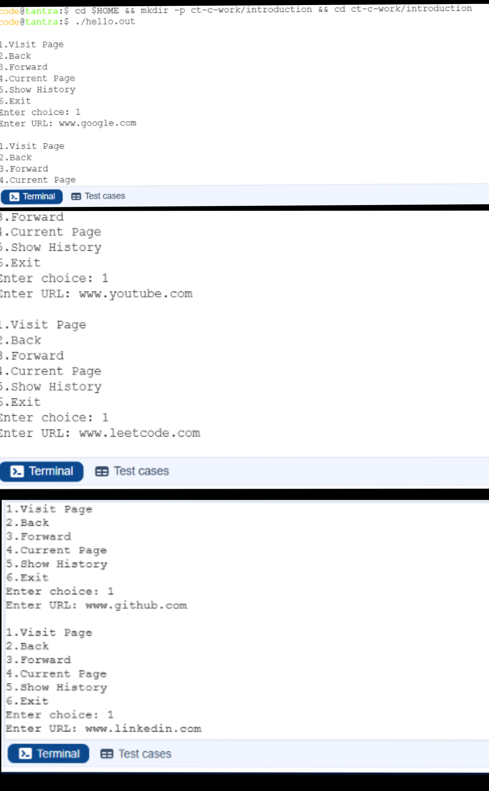
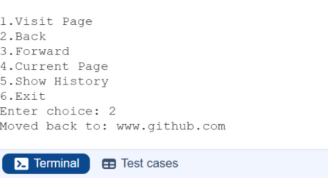
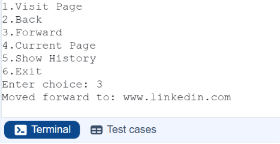
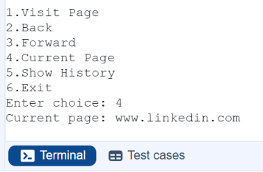
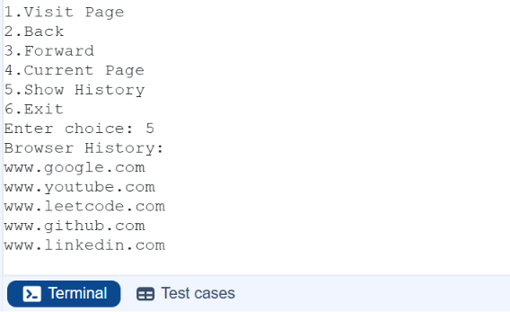
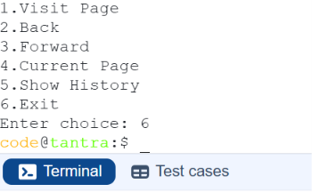

# Browser-History-Simulation-Using-Linked-List
A Data Structures project implemented in C using Doubly Linked List to simulate browser history navigation.
## Output Screenshot

## Sample Outputs
### Visiting Pages

### Going Back

### Going Forward

### Current Page

### Browser History

### Exit

